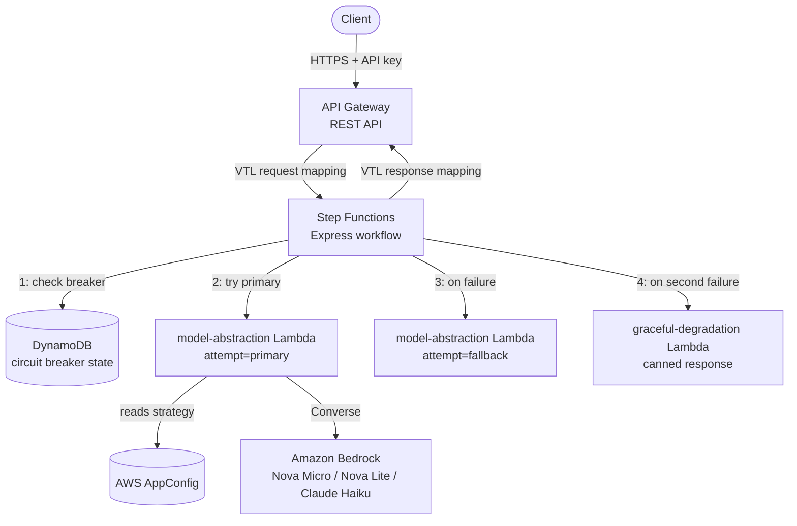
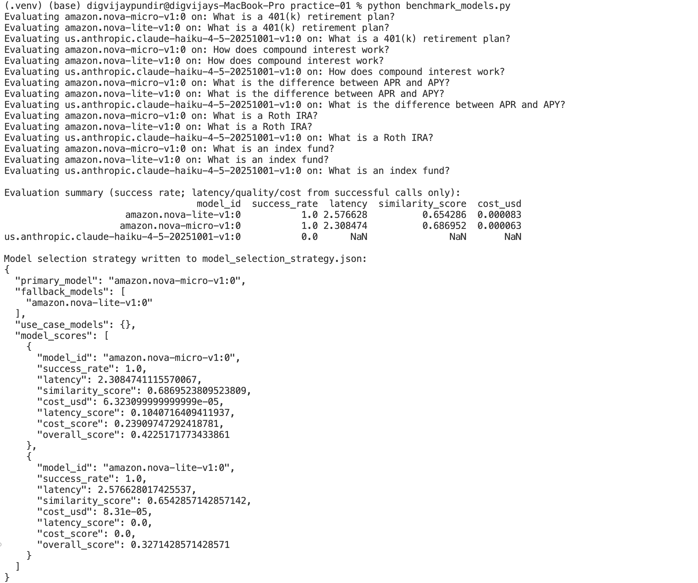
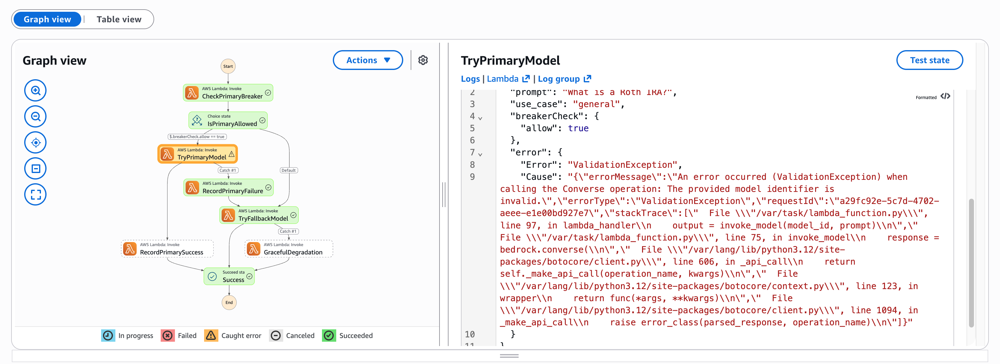
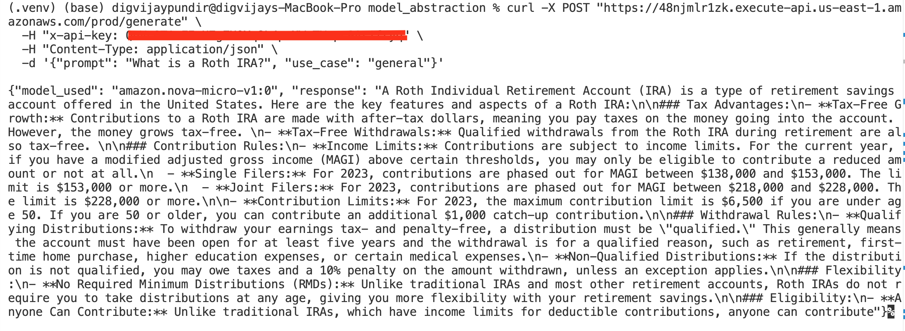

# Practice 01 — Resilient Multi-Model AI Assistant on Amazon Bedrock

From an AWS Exam Prep bonus assignment (`#awsexamprep`): build a customer-service AI assistant
for a financial-services company that doesn't depend on a single foundation model — it should
pick between models on quality, latency, cost, and availability, and keep answering customers
even when a model is slow, down, or wrong for the job.

The assignment ships with example code. The shape of it is right, but a fair amount of the
actual code is outdated (deprecated APIs, retired model IDs) or has bugs that would quietly
break the resilience story it's supposed to demonstrate. So this is both "what I built" and
"what was wrong with the reference" — I fixed things as I hit them rather than auditing first.

Parts 1-3 were built and tested live on my own AWS account. Part 4 I only designed on paper —
why, further down.

## What I was building

A financial-services chatbot that answers product questions, generates responses per customer
inquiry, stays available when something upstream breaks, and doesn't do anything a compliance
team would object to.

The design principle underneath it: never hard-code a model. Which model answers a request is
read from configuration at request time, not baked into code, so it can be swapped, rolled back,
or failed over without a redeploy.

## Architecture



Client hits API Gateway with an API key. A request mapping template hands the body to Step
Functions, which checks the circuit breaker before even trying the primary model. Primary fails
→ record it, try the fallback. Fallback fails too → canned "we're having issues" response
instead of an error. A response mapping template unwraps Step Functions' output back into
something the client can use.

Cross-region failover (CloudFormation in two regions, Route 53 health checks) is in the
original design but I didn't build it — it's the one part with a genuine recurring cost (a
hosted zone and health checks bill monthly regardless of use), and the circuit breaker already
proves the resilience concept. Documented, not built.

## Part 1 — benchmarking the models

Picking a model isn't a vibe check — compare candidates on quality, latency, cost, and (for a
regulated domain) whether guardrails catch what they're supposed to. The reference script loops
over model IDs and test questions, times each call, and does a rough word-overlap similarity
check.

The model list itself was already wrong before I wrote a line of code. The example uses
`anthropic.claude-instant-v1` and `amazon.titan-text-express-v1` — neither exists anymore.
Titan Text Express is fully retired (`ResourceNotFoundException`). I ran
`aws bedrock list-foundation-models` myself to see what's actually live, and settled on Nova
Micro, Nova Lite, and Claude Haiku 4.5 — a cheap-tier, two-provider comparison. Claude Haiku
needs its cross-region inference profile ID (`us.anthropic.claude-haiku-4-5...`), not the bare
model ID — found that out via `ValidationException`.

Other gaps in the reference: cost per request is a stated comparison dimension but never
computed; no guardrail check despite that also being stated; `ThreadPoolExecutor` gets imported
for throughput testing and never used; the per-provider `if/elif` has no fallback branch, so an
unrecognized provider throws `NameError`.

My version uses the Converse API instead — one request/response shape across providers, so the
branching disappears entirely. Real token counts come back in the response, so cost is just
tokens × published price instead of guesswork. I kept quality scoring as plain word overlap for
this pass, deliberately — not a great metric, but getting the pipeline (benchmark → weighted
score → AppConfig strategy) working end to end mattered more than the scoring method for a v1.

```python
def invoke_model(model_id, prompt, max_tokens=500):
    start = time.time()
    response = client.converse(
        modelId=model_id,
        messages=[{"role": "user", "content": [{"text": prompt}]}],
        inferenceConfig={"maxTokens": max_tokens, "temperature": 0.7, "topP": 0.9},
    )
    latency = time.time() - start
    output = response["output"]["message"]["content"][0]["text"]
    usage = response.get("usage", {})
    return output, latency, usage.get("inputTokens", 0), usage.get("outputTokens", 0)
```

Full code's in `practice-01/benchmark_models.py`. One real bug from actually running it: when
Claude Haiku failed every call in one run, my first aggregation quietly averaged the *failure*
latency in with the successful calls — making the broken model look fastest, since failing fast
beats a real 2-second response. Fixed by splitting success/failure so a model with zero working
calls gets excluded from scoring entirely.

Landed on Nova Micro as primary, Nova Lite as fallback. That decision becomes
`model_selection_strategy.json`, which Part 2 reads.



## Part 2 — making the model choice configurable

Goal: change which model answers requests without touching code. Three pieces — AppConfig holds
the Part 1 strategy, a Lambda reads it and calls Bedrock, API Gateway gives clients one stable
endpoint.

Two real bugs in the reference here. First: it calls `appconfig.get_configuration(...)`, which
is deprecated — current AppConfig reads go through a separate `appconfigdata` client
(`start_configuration_session` + `get_latest_configuration`). Second, bigger: when the model
call fails, `invoke_model` catches the exception and *returns* an error string as a normal 200.
Once this Lambda sits behind Step Functions (Part 3), its `Catch` never fires, because nothing
looks like it failed — the fallback logic is dead code. Fixed by just letting it raise:

```python
def invoke_model(model_id, prompt):
    response = bedrock.converse(...)
    return response["output"]["message"]["content"][0]["text"]
    # let it raise on failure — Step Functions needs the exception to catch it
```

Setting up AppConfig itself (application → environment → profile → hosted version → deployment)
was mostly fine, one correction: the reference uses `AWS.AppConfig.FeatureFlags` as the profile
type, which expects a different schema — plain config needs `AWS.Freeform`.

IAM was the annoying part. I used a scoped IAM user for the whole project instead of my admin
login, so I could tear it all down without touching anything else — and then found several
policies I'd "attached" hadn't actually stuck (a `ListFoundationModels` call failed with
AccessDenied despite `AmazonBedrockFullAccess` supposedly being there). AppConfig doesn't even
have an attachable managed policy at all — searching only turns up a reserved
service-linked-role policy — so that needed a custom inline policy, and `appconfigdata:*` isn't
a real IAM namespace either (both planes live under plain `appconfig:`, per IAM's own validator
rejecting my first attempt).

Also put an API key requirement on API Gateway (the reference uses `AuthorizationType: NONE`,
a fully open endpoint for something financial-services-themed), which led to a `Forbidden` I
never fully root-caused — every setting checked out, best guess is an EDGE/CloudFront
propagation delay, since it started working with no changes once enough time had passed.

## Part 3 — actually resilient

The reference calls its retry-then-fallback logic a "circuit breaker," but there's no breaker
in it — no persisted state, nothing that remembers a model's been failing. That's retry with a
fallback, not a breaker.

A real one needs state: closed (healthy), open (too many recent failures, skip it for a
cooldown), half-open (cooldown's up, one trial call). Built with a small DynamoDB table, keyed
by *role* ("primary"/"fallback") rather than model ID, since the model behind a role can change
via AppConfig but "has this slot been failing" stays meaningful regardless.

Step Functions orchestrates it: check the breaker → try primary if allowed → on failure, record
it and try fallback → on failure, degrade to a canned response. Pasted the workflow as raw ASL
rather than clicking through Workflow Studio state by state — too many fiddly per-state fields
(ResultPath, Catch blocks) to risk after the IAM mess in Part 2.

To actually prove it rather than trust the code, I deployed a broken `primary_model` via
AppConfig on purpose and ran it repeatedly. First three runs: primary fails, gets caught,
fallback answers, customer never sees an error. Fourth run, past the failure threshold: the
execution graph shows it skipping the primary attempt *entirely*, straight to fallback — the
actual point of a breaker versus plain retry, not wasting calls on something already known
broken. Reverted the config, waited out the cooldown, watched one half-open trial succeed and
reset it to closed.



Two bugs in my own first attempt, not the reference: the model-abstraction Lambda caches its
AppConfig session token across warm invocations. AppConfig's polling API returns empty content
when nothing's changed since the last poll — documented, expected — but my first version
treated empty as an error, so the cold start worked and every warm call after it failed. Found
it by accident, using API Gateway's console Test button (which skips auth) while debugging the
unrelated `Forbidden` issue above.

The other: wiring API Gateway directly to Step Functions via VTL (chose this over a thin Lambda
wrapper to see the native AWS-service-integration pattern). `$util.escapeJavaScript()` produces
an invalid `\'` for apostrophes — and real model output is full of "doesn't" and "it's," so this
would've broken most real responses, not an edge case. Fixed with `.replaceAll("\\'","'")`.

The full chain, working end to end — client request through API Gateway, Step Functions, Bedrock, and back (API key redacted):



## What I skipped, and why

**Cross-region + Route 53** — covered above: real recurring cost, and the circuit breaker
already proved the resilience concept.

**Part 4 (fine-tuning/lifecycle)** — documented only. A deployed SageMaker endpoint bills hourly
regardless of use, the one real way to accidentally rack up a bill here. And the reference's own
approach doesn't connect to anything else it built anyway — it fine-tunes `distilgpt2` via
SageMaker, producing a SageMaker endpoint, which can't be called through `bedrock.converse()`
like everything else in this project.

The path that would actually fit: Bedrock's own model customization or Custom Model Import,
still Bedrock-invokable. Fine-tune → new model ARN → drop it into a new AppConfig version as
primary — same mechanism I already used to swap in a broken model for testing. Gate it behind a
Part 1 benchmark re-run; rollback is just redeploying the previous AppConfig version, already
proven by the circuit breaker recovery test.

## Bugs found

| # | Where | Issue → fix |
|---|---|---|
| 1 | model-abstraction Lambda (reference) | Returns an error string instead of raising, so Step Functions' `Catch` never fires → raise on failure |
| 2 | IAM policy (reference) | `bedrock-runtime:InvokeModel` isn't a real action → use `bedrock:InvokeModel` |
| 3 | Compliance (reference) | Guardrails required but never applied → pass `guardrailIdentifier`/`guardrailVersion` |
| 4 | AppConfig (reference) | `get_configuration()` is deprecated → `appconfigdata` (`start_configuration_session` + `get_latest_configuration`) |
| 5 | benchmark script (reference) | No `else` branch for unknown providers → `NameError` → Converse API removes the branching |
| 6 | benchmark script (reference) | Cost per request never computed → read real `usage` from the response |
| 7 | benchmark script (reference) | Throughput never measured despite importing `ThreadPoolExecutor` → actually run it under concurrency |
| 8 | quality metric (reference) | Word overlap rewards verbosity → embedding similarity or LLM-as-judge (not implemented here either, known limitation) |
| 9 | IAM policy (reference) | `Resource: '*'` on Bedrock → scope to the specific model ARNs used |
| 10 | API Gateway (reference) | `AuthorizationType: NONE` → added an API key requirement |
| 11 | resilience design (reference) | "Circuit breaker" has no state, it's retry+fallback → built a real one on DynamoDB |
| 12 | model IDs (reference) | Retired/legacy IDs → Titan Text Express is gone, Claude Haiku needs an inference profile ID |
| 13 | Part 4 (reference) | `train.py` truncated; SageMaker output isn't Bedrock-invokable → documented a Bedrock-native alternative |
| 14 | model-abstraction Lambda (mine) | Treated AppConfig's "nothing changed" empty response as an error → cache last-known-good config |
| 15 | API Gateway VTL (mine) | `escapeJavaScript` produces invalid `\'` for apostrophes → `.replaceAll("\\'","'")` |

## Cost and cleanup

Can incur real AWS charges (Bedrock, Lambda, API Gateway, Step Functions, DynamoDB), but Parts
1-3 are all pay-per-request — nothing bills while idle. The one thing that would bill
continuously is a SageMaker endpoint, which is exactly why Part 4 wasn't deployed.

Set a billing budget first. [Practice-01-Setup-Log.md](./Practice-01-Setup-Log.md) has every
resource created and how to delete each one — doubles as the teardown checklist.

---

_Part of [Gen AI Practice](./README.md)._
