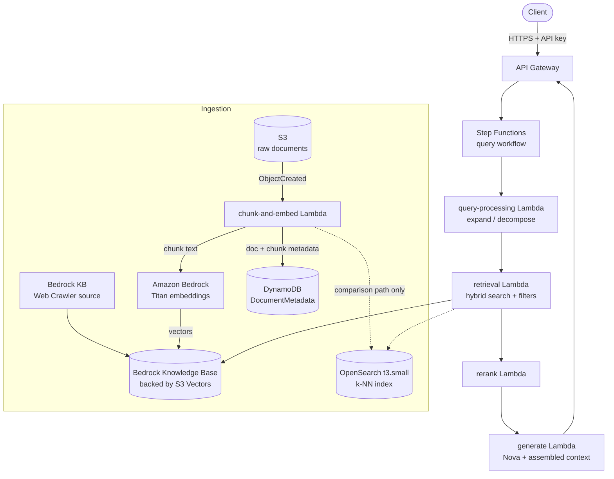

# Practice 02 — RAG Assistant over Technical Documentation

From an AWS Exam Prep bonus assignment (`#awsexamprep`): build a retrieval-augmented generation
system over technical documentation — ingest documents, chunk and embed them, store the vectors,
retrieve the right ones for a question, and have a foundation model answer using that retrieved
context instead of whatever it happens to remember.

The assignment actually arrived as **two separate projects** that decompose the same problem
differently. Project A ("vector store infrastructure") lists six phases of tasks but its
implementation code cuts off mid-function partway through Phase 4, so Phases 5 and 6 have no
code at all. Project B ("technical documentation RAG") has code for all six phases but a
different breakdown. Rather than build either half-finished, I merged them — each capability
taken from whichever project covered it better.

As with Practice 01, the reference code ships with real bugs and dead model IDs, so this is
both "what I built" and "what was wrong with the reference."

## Where the two projects overlap

| Capability | Project A | Project B | Taking from |
|---|---|---|---|
| Chunking strategies | semantic only | 3 strategies + eval harness | **B** |
| Embedding models | Titan only | Titan vs Cohere + batching + quality metrics | **B** |
| Vector store setup | Bedrock KB, OpenSearch, DynamoDB | OpenSearch, Aurora pgvector, Bedrock KB | both |
| Document metadata store | DynamoDB schema + GSI | — | **A** |
| Hierarchical / multi-index search | Phase 3 | — | **A** |
| Hybrid search + reranking | — | Phase 4 + MRR/NDCG | **B** |
| Source connectors (web, wiki, DMS) | Phase 4 (truncated) | — | **A** |
| Maintenance & sync | Phase 5 (no code) | — | **A** |
| Query expansion / decomposition | — | Phase 5 + Step Functions | **B** |
| API layer | mentioned | Phase 6 with code | **B** |
| UI | Amplify | — | **A** |
| Evaluation metrics | — | precision/recall, MRR, NDCG | **B** |

Together they cover a full RAG lifecycle, which is why merging was worth doing rather than
picking one.

## Architecture

A question comes in through API Gateway, Step Functions decides whether it needs decomposing
into sub-questions, each question gets expanded into alternate phrasings, those hit the vector
store, results get re-ranked, and the top few become context for a Nova call that produces the
final answer with citations back to the source documents.

The dotted OpenSearch path is deliberate — see *Vector store strategy* below.

---

## Definitions

The vocabulary this project runs on. Worth being precise about, because several of the
reference's bugs come from conflating these.

**RAG (Retrieval-Augmented Generation)** — instead of relying on what a model memorised during
training, you retrieve relevant documents at question time and paste them into the prompt as
context. The model's job becomes reading comprehension over supplied text rather than recall.
Fixes staleness and hallucination, and lets you cite sources.

**Embedding** — a fixed-length vector of floats representing the *meaning* of a piece of text.
Texts with similar meaning land close together in that vector space. Produced by an embedding
model (here, Amazon Titan Text Embeddings).

**Dimension** — how many floats are in that vector. Titan Text Embeddings v1 produces 1536;
v2 produces 1024 by default. **A vector index is built for one specific dimension** — you cannot
put v1 and v2 vectors in the same index. This is the source of one of the reference's bugs.

**Chunk** — documents are too long to embed whole (and too long to be useful context), so
they're split into pieces. Each chunk gets its own embedding and is retrieved independently.

**Chunking strategy** — how you decide where to split:
- *Fixed-size with overlap* — every N characters, with the last M characters repeated into the
  next chunk so a sentence spanning a boundary isn't lost.
- *Hierarchical / structural* — split on the document's own structure (headings, sections), so
  chunks align with meaningful units and can carry parent-child relationships.
- *Semantic* — split where the topic actually shifts, detected by comparing embeddings of
  adjacent sentences rather than counting characters.

**Overlap** — the deliberate repetition between consecutive chunks. Guards against a relevant
passage being cut in half. Costs storage and embedding calls proportional to how much you repeat.

**Vector store / vector database** — storage that indexes vectors for similarity search rather
than exact key lookup. Answers "which stored vectors are closest to this query vector."

**Cosine similarity** — the standard way to measure "closeness" between two embeddings: the
cosine of the angle between them, ranging −1 to 1. Measures direction (meaning) while ignoring
magnitude (roughly, length/emphasis).

**k-NN (k-Nearest Neighbours)** — retrieve the k vectors closest to the query vector.

**ANN (Approximate Nearest Neighbour)** — exact k-NN means comparing against every stored
vector, which doesn't scale. ANN trades a small amount of recall for a very large speedup by
searching a smart index structure instead of everything.

**Amazon OpenSearch Service** — a managed, distributed search and analytics engine (AWS's fork of
Elasticsearch/Apache Lucene). It was built for full-text search and log analytics, not vector
search — but its `k-NN` plugin lets an index also store embeddings and search them with an ANN
algorithm like HNSW, which is what makes it usable as a vector database at all. That dual nature
is exactly why it matters for RAG: OpenSearch is one of the few systems that can run genuine
keyword search (BM25) and vector search *in the same index, in the same query*, which is what
real hybrid search needs. Bedrock Knowledge Bases' `retrieve()` API is convenient but abstracts
all of this away — you get results back without ever seeing or tuning the underlying index.

What the skipped Stage 3b step (see the build log's *What I skipped*) would have involved: stand
up a single-node OpenSearch domain, define an index with a `knn_vector` field mapping (dimension,
engine, HNSW parameters), push chunk embeddings into it directly, and run raw `knn` queries and
combined keyword-plus-vector queries by hand — seeing the exact mechanics Bedrock KB normally
hides behind one API call.

Why it's worth understanding regardless of whether you actually build it: OpenSearch (via its
Elasticsearch heritage) is the most common self-hosted or semi-managed vector search backend in
production RAG systems outside fully-managed options like Bedrock KB or a dedicated vector
database, and HNSW/k-NN tuning comes up constantly in both AWS certification material and
system-design interviews. Its cost profile is also the clearest illustration of this whole
project's central tradeoff: a cluster bills by the hour whether it's queried or not, which is
precisely why it was kept short-lived rather than left running, and precisely why it was cut once
the fully-managed path already worked.

**HNSW (Hierarchical Navigable Small World)** — the ANN algorithm OpenSearch uses. Builds a
layered graph where each vector links to its neighbours; search walks the graph greedily.
Three parameters matter:
- `m` — max connections per node. Higher = better recall, more memory.
- `ef_construction` — how many candidates to consider while *building* the index. Higher =
  better-quality graph, slower indexing.
- `ef_search` — how many candidates to consider while *querying*. Higher = better recall,
  slower queries. Tunable at query time without rebuilding.

**Semantic search vs keyword search** — semantic (vector) search finds text that *means* the
same thing even with no shared words. Keyword search (BM25) finds exact term matches. Each
fails where the other succeeds: semantic search misses exact identifiers like error codes and
version numbers; keyword search misses paraphrases.

**Hybrid search** — running both and combining the results, to get both behaviours.

**RRF (Reciprocal Rank Fusion)** — the usual way to combine two ranked lists that have
incomparable score scales. Each document scores `sum(1 / (k + rank))` across the lists it
appears in, with `k` typically 60. Uses only rank position, so it sidesteps the problem that a
BM25 score of 12.4 and a cosine similarity of 0.83 aren't on the same scale.

**Bi-encoder** — encodes the query and each document *separately*, so document embeddings can
be computed once, in advance. Fast, which is why it's what the vector store uses.

**Cross-encoder** — encodes the query and one document *together* in a single pass, so the model
can attend across both. More accurate, far too slow to run over the whole corpus. This is what a
reranker is.

**Reranking** — retrieve a generous candidate set cheaply (bi-encoder, say top 20), then re-score
just those with an expensive-but-accurate model (cross-encoder) and keep the best few. Best of
both.

**Query expansion** — rewriting one question into several phrasings before searching, so
vocabulary mismatch between the question and the documents matters less.

**Query decomposition** — breaking a complex multi-part question into independent sub-questions,
answering each, then combining. "How does X compare to Y for Z?" is really three retrievals.

**Precision** — of the results returned, what fraction were relevant. **Recall** — of all the
relevant documents that exist, what fraction did you return.

**MRR (Mean Reciprocal Rank)** — averages `1 / (rank of the first relevant result)` over a set
of test queries. Only cares where the *first* good answer lands. Right metric when one correct
answer is enough.

**NDCG (Normalised Discounted Cumulative Gain)** — scores the whole ranked list, giving more
credit to relevant results near the top, normalised against a perfect ranking so it lands
between 0 and 1. Right metric when the ordering of several results matters.

**Grounding** — constraining the model to answer only from the supplied context, and to say it
doesn't know rather than inventing something when the context doesn't cover the question.

**Chunk metadata / filtering** — attributes stored alongside each vector (document type, author,
date, source system). Lets you restrict search to a subset before or during vector search, which
improves both relevance and access control.

**Bedrock Knowledge Base** — Bedrock's managed RAG service. Point it at an S3 bucket (or a web
crawler, or Confluence/SharePoint), pick an embedding model and a chunking strategy, and it
handles ingestion, embedding, storage, and retrieval. Requires a vector store backend, which is
where the cost decision lives.

**S3 Vectors** — vector storage native to S3. Pay for storage and queries rather than for a
cluster that runs continuously. This is what makes the whole project affordable.

---

## Vector store strategy — the one decision that sets the cost

Every architecture choice here was cheap except this one, so it got decided first.

The reference specifies multi-node OpenSearch (`r6g.large.search` × 3 in Project A, × 5 in
Project B) plus Aurora PostgreSQL with pgvector. Those bill **by the hour, forever**, whether
anything is querying them or not — roughly $365-600/month for the OpenSearch clusters and another
$45-60 for Aurora. That's not a learning-project budget.

There's also a trap that isn't in the reference at all: creating a Bedrock Knowledge Base in the
console defaults to "quick create a new vector store," which silently provisions **OpenSearch
Serverless** at a 2-OCU minimum — about **$0.48/hour, ~$350/month**, for a knowledge base holding
fifty documents. Very easy to walk into.

What I'm doing instead:

- **Bedrock Knowledge Base backed by S3 Vectors** as the durable store. ~$0 idle, pay per query,
  console-creatable. This is the managed-RAG path.
- **A single-node `t3.small.search` OpenSearch domain, created and deleted the same day**, only
  for the sessions where I'm learning k-NN index mappings, HNSW tuning, and hybrid queries.
  At ~$0.04/hour that's about a dollar for a full day of experimenting.
- **Skipping Aurora pgvector entirely** — it's a third vector store teaching the same lesson as
  the second, and adds VPC complexity plus idle cost for no additional learning.

## Cost

| Component | Cost |
|---|---|
| S3 (documents + vectors) | cents/month |
| Bedrock KB on S3 Vectors | ~$0 idle, per-query |
| DynamoDB (On-Demand), Lambda, Step Functions Express, API Gateway | **$0 idle** |
| Embeddings — ~500 pages × 3 chunking strategies × 2-3 models | well under $1 total |
| Nova inference — hundreds of test queries | pennies |
| OpenSearch `t3.small.search` — **only while running** | ~$0.04/hr → ~$1/day |

**Expected total: under $5**, assuming OpenSearch comes up for two or three sessions and gets
deleted each time.

The one thing that bills silently: **CloudWatch custom metrics and dashboards charge monthly just
for existing** (roughly $0.30/metric and $3/dashboard beyond the free tier), regardless of whether
anyone looks at them. Sticking to default metrics unless a dashboard is specifically the thing
being learned.

Every resource created gets logged in [SETUP-LOG.md](./SETUP-LOG.md),
which doubles as the teardown checklist.

---

## Build stages

### Stage 1 — Foundation and ingestion

S3 bucket with prefixes per document type (technical docs, research papers, policies), a
DynamoDB table for document and chunk metadata, a fresh scoped IAM user, and confirmation that
Bedrock models are reachable.

The metadata table uses `document_id` as partition key and `chunk_id` as sort key, with a GSI on
`document_type` + `last_updated` so you can list "all policy documents changed since X" without
scanning. Worth asking early whether this duplicates what the Knowledge Base already stores —
partly yes, but it's the store for things the KB doesn't track (checksums for change detection,
embedding status, parent-child chunk relationships).

**IAM lesson carried over from Practice 01:** the scoped user there could create resources but
not delete them, which forced half the teardown onto the admin profile. This one gets
`Delete*`/`Detach*` from the start.

**Trap to avoid:** the ingestion Lambda writes its output back into the same bucket that triggers
it. Without a prefix-scoped trigger that's an infinite loop burning Bedrock calls. Trigger scopes
to `raw-docs/` only.

### Stage 2 — Chunking and embedding lab

Three chunking strategies (`chunking.py`) run against a 6-page corpus of real AWS documentation
(Lambda, S3, DynamoDB, Bedrock, Step Functions, API Gateway — fetched via AWS docs' native
`.md` endpoint, not the HTML), then compared with two embedding models (`embeddings.py`) via a
hand-built 10-question test set (`test_questions.py`) plus a cosine-similarity contrast check.

**Result: retrieval hit_rate@3 and MRR both came back 1.000 for every single combination of
strategy × model.** That's not six approaches tying for first — it's the eval failing to
discriminate at all. With only 6 documents on clearly distinct topics and document-level
relevance grading, any reasonable embedding trivially finds the right document; there's nothing
genuinely ambiguous for a weaker approach to get wrong. A real signal would need either
chunk-level grading (does the retrieved chunk contain the actual answer text, not just come from
the right document) or a corpus with topically-overlapping documents. Neither was worth building
for a 6-page lab corpus, so this stays a documented limitation rather than a fixed one.

The contrast check *did* discriminate: Titan v2 separated known-similar from known-dissimilar
sentence pairs more cleanly than v1 (0.599 vs. 0.454 average gap). Combined with v2 being the
newer, cheaper (1024 vs. 1536 dimensions), currently-recommended model, that's what decided it.

**Decision: Titan v2 embeddings, hierarchical chunking.** Hierarchical wins on structural
grounds the saturated eval couldn't confirm or deny either way — it respects the documents' real
heading structure and produces parent-child section metadata for free, which Stage 3's DynamoDB
metadata table is designed to store. Both choices carry forward into every later stage.

This runs **locally** against Bedrock and costs well under a dollar.

### Stage 3 — Vector store

Bedrock Knowledge Base on S3 Vectors as the durable store, ingesting from the S3 corpus. Built,
synced, and verified end-to-end with a real `retrieve()` call returning the correct source chunk
at 0.94 relevance — see the setup log for the two wrong turns along the way (a "Managed KB" that
silently doesn't use the vector store you built, then an S3 Vectors filterable-metadata limit)
and the Q&A doc for both written up as scenario questions.

**Skipped the short-lived OpenSearch domain.** The original plan paired the managed KB with a
hand-built OpenSearch k-NN index, purely to see HNSW tuning and raw hybrid queries directly rather
than through Bedrock's abstraction. Once the KB was actually working end-to-end, the marginal
learning value didn't justify the additional AWS console setup and ~$1/day cost — the HNSW/k-NN
concepts are already covered on the theory side (Q&A doc), and Stage 4's hybrid search work
doesn't require a second vector store to build.

### Stage 4 — Retrieval quality (built, evaluated, same saturation finding as Stage 2)

Built all four pieces the plan called for: BM25 keyword search (`rank_bm25`, local, no AWS
calls), the Bedrock KB's vector search from Stage 3, Reciprocal Rank Fusion to combine the two
document-level rankings, and Nova-as-LLM-judge reranking of the actual retrieved chunk text
(standing in for Cohere's rerank model, which is still not reliable enough to build on — see
"Model availability"). Metadata filtering was also verified working, scoped to a `service`
attribute added via S3 metadata sidecar files.

**Result: hit_rate@3, MRR, and NDCG all came back 1.000 for every one of the four approaches**,
keyword-only included. This is the identical structural finding as Stage 2's embedding
comparison, for the identical reason: 6 documents on clearly distinct topics means there's
nothing genuinely ambiguous for BM25, vector search, hybrid, or reranking to get wrong relative
to each other. A meaningful comparison here needs either a corpus with real topical overlap
(multiple documents that could plausibly answer the same question) or chunk-level relevance
grading — the same gap noted in Stage 2, not fixed here either, for the same reason: not worth
building for a 6-page lab corpus. The pipeline itself — BM25, RRF, and LLM-judge reranking — is
now built, working, and reusable; it's specifically the *comparison* that this corpus can't
support.

One real bug surfaced along the way, worth its own note below the fold (bugs table, #19): Nova
returned 2 relevance scores for a prompt that only contained 1 passage to score.

### Stage 5 — Query processing (built, deployed, verified live)

Five Lambdas (`query-router`, `query-expand`, `query-decompose`, `search`, `aggregate`), a
DynamoDB cache table (`RagQueryCache`, TTL-based), and a Standard Step Functions workflow tying
them together: check the cache and classify simple-vs-complex in one call → Choice state →
simple path (expand into 3 phrasings, search+rerank) or complex path (decompose into independent
sub-questions, fan out with a Map state running expand+search per sub-question in parallel,
aggregate the deduped results) → write to cache → return.

Every Lambda was tested locally against the real Bedrock/KB/DynamoDB resources before deploying
(catching, among other things, Nova returning 2 relevance scores for a 1-passage prompt — see bug
#19), then tested live post-deploy. The full workflow was verified against all three paths:
- **Simple** — correct answer, expand → search.
- **Cache hit** — re-ran the same question; execution history confirms only 2 states ran
  (`CheckCacheAndClassify` → `ReturnCached`), skipping the entire pipeline.
- **Complex** — a 3-part comparison question decomposed into 4 sub-questions (Nova added a
  "how do these compare" question beyond the 3 individual topics), fanned out through the Map
  state, and aggregated into 5 deduped chunks spanning 3 different source documents.

Two real bugs surfaced during the first two workflow executions — both the same underlying
mistake in two different places, which is exactly why it's worth writing up once clearly (bugs
table, #20 and #21): a Step Functions `ResultSelector` field with a JSONPath (`"x.$": "$.Payload.x"`)
is not optional. If that key is ever absent from a Lambda's response — even on a code path the
state machine won't go on to use — the whole state fails with `States.Runtime`. Both
`query-router`'s branches now always return the same full set of keys, using `null` as a
placeholder for whichever field that branch didn't compute.

**Later modified by Practice 03**: `search`'s KB retrieve call originally had no resilience at all
(no retry, no circuit breaker — a throttled or unavailable Knowledge Base would just crash the
Lambda). Practice 03's Stage 7 retrofits its resilience pattern onto this exact call; see
[Practice-03 Stage 7](../practice-03/README.md#stage-7--retrofitting-resilience-onto-practice-02s-retrieval-path-built-and-verified-live)
for the full record — that's where this specific change is documented, not here.

### Stage 6 — The RAG application (built, deployed, verified live in a browser)

One new Lambda (`generate`), one API Gateway REST API, one static local HTML page — this is where
everything from Stages 3-5 finally becomes a thing you can actually ask a question to.

`generate` is the bridge between Stage 5's retrieval workflow and a real answer: it starts the
`rag-query-workflow` execution, polls for it to finish (Standard state machines have no
synchronous invoke API, unlike Express — see Stage 5), then hands the retrieved chunks to Nova
with an explicit grounding instruction — answer only from the sources, cite them inline by
`[Source N]`, say so plainly if the sources don't cover the question rather than guessing.

API Gateway wraps that in `POST /ask`, Lambda-proxy integration, CORS enabled (needed since the
UI calls it directly from a browser), no API key — a deliberate simplification from Practice 01's
financial-services-themed setup, since this is a personal test tool, not anything handling real
user data.

The UI is a single self-contained `index.html` — no build step, no framework, just `fetch()` against
the live API Gateway URL. Verified by actually opening it in a real browser and asking it a real
question (not just claiming it works from reading the code) — got a correctly grounded, cited
answer rendered with its source.

One real bug on the way: the first live test of `generate` hit `Sandbox.Timedout` at Lambda's
*default* 3-second timeout — the 28-second console change from the plan hadn't actually saved.
Fixed directly via `update-function-configuration` rather than repeating the console step blind.

### Stage 7 — Maintenance (built, deployed, verified live end-to-end)

One new Lambda (`check-and-sync`), an IAM widening, and an EventBridge scheduled rule — the goal
is to make document sync automatic without paying for a Bedrock ingestion job on every tick, only
when something actually changed.

The mechanism: list S3 objects under `raw-docs/`, and for each one compare its **ETag** (S3's
free MD5 checksum for non-multipart uploads — no need to download content just to hash it)
against a value stored from last time. That stored value lives in `RagDocumentMetadata` — Stage 1's
existing table, reused with a sentinel sort-key (`chunk_id = "SYNC_CHECKSUM"`) for document-level
sync state rather than standing up a whole new table for one field. If nothing changed,
`check-and-sync` returns immediately without calling Bedrock at all. If anything changed, it calls
`start_ingestion_job()` once for the whole data source — there's no per-file ingest API.

That raised a real question worth checking rather than assuming: doesn't "ingest the whole data
source" mean re-embedding everything on every sync, defeating the point? Checked the actual
mechanics (AWS docs, then confirmed live): Bedrock's own ingestion job is **itself incremental** —
it scans every document's metadata against what it already has indexed, and only chunks+embeds the
ones that are new, modified, or deleted. Proved this directly rather than trusting the docs alone:
deliberately touched one file in S3, triggered a sync, and pulled the job's actual statistics —
`numberOfDocumentsScanned: 6`, `numberOfModifiedDocumentsIndexed: 1`. Six docs scanned, exactly one
re-embedded. So `check-and-sync`'s checksum gate and Bedrock's own internal incrementality are two
layers of the same idea at different granularity: ours decides whether to *start* a job at all
(avoiding the scan-phase overhead on every scheduled tick when nothing's changed); Bedrock's own
sync decides, of the objects in scope, which ones actually need re-embedding.

Verified with a genuine two-part live test, not just "it ran without erroring": invoked
`check-and-sync` right after deploy and got `{"synced": false, "reason": "no changes detected"}` —
correct, since nothing had changed since the local test seeded the checksums. Then deliberately
edited one file in S3 and invoked again: `{"synced": true, "changedDocuments":
["raw-docs/lambda-concurrency.md"]}`, plus a real ingestion job confirmed via
`list-ingestion-jobs`/`get-ingestion-job`. Both the no-op and the real-sync paths are proven, not
just the happy path.

The EventBridge rule (`rag-assistant-doc-sync-schedule`) triggers `check-and-sync` on a schedule.
Set to `rate(5 minutes)` temporarily to actually watch it fire automatically (confirmed via a
CloudWatch Logs poll — it invoked on its own with no errors), then dialed back to `rate(1 day)`
once proven, since a docs corpus like this doesn't need frequent checks and EventBridge Rules bill
per event anyway, not per hour. One real bug on the way here — see bugs table #22: the AWS console
has two different scheduling products under similar names, and picking the wrong one costs an
IAM detour that doesn't apply to the other.

### Stage 8 — Streamed responses (built, deployed, verified live in a browser)

Not in the original plan — added after actually asking "how would we make the UI feel more
responsive" and discovering the answer isn't a small tweak to Stage 6's Lambda. Three new Lambdas
(`ws-connect`, `ws-disconnect`, `ws-ask`), a WebSocket API Gateway, and a UI toggle so both paths
stay testable side by side.

The reason this needed a different architecture rather than a flag on `generate`: checked first
rather than assumed, and confirmed AWS Lambda's native response streaming (`InvokeMode:
RESPONSE_STREAM` on a Function URL) only supports **Node.js managed runtimes and custom
runtimes** — not Python, without wrapping it in something like the Lambda Web Adapter. Rather than
rewrite the retrieval/generation Lambda in another language or add an adapter layer for one
feature, the AWS-native path for streaming *to a browser* from Python is a **WebSocket API**: the
client opens a `wss://` connection, and the Lambda pushes messages back explicitly via
`apigatewaymanagementapi.post_to_connection()` — these are independent API calls made *during* the
Lambda's execution, not a streamed HTTP response, so the Python-response-streaming limitation
doesn't apply to this pattern at all.

Since this is one client asking one question and getting one streamed answer back — not
broadcasting to arbitrary other connections — `$connect`/`$disconnect` don't need a
connections-tracking table; they're trivial no-ops. All the real work is in `ws-ask`: same
retrieval as `generate` (Step Functions workflow), then Bedrock's `converse_stream()` instead of
`converse()`, pushing each token as it arrives, then a final `{"done": true, "sources": [...]}`
message.

Verified this was genuinely incremental, not a fast buffered dump that only *looks* instant:
reran a real WebSocket call with per-message timestamps and got tokens spread across ~0.9 seconds
after a ~2-second retrieval delay — real streaming, just fast, because Nova Lite generating a
short 1-3 sentence grounded answer doesn't leave much of a window for the eye to catch mid-stream.
That distinction matters for the write-up: streaming's visible benefit scales with how long
generation actually takes, not just whether the mechanism is real.

One real bug on the way — see bugs table #23: the existing `bedrock:InvokeModel` grant from Stage
5 doesn't cover `converse_stream()`, which calls a *separate* IAM action
(`bedrock:InvokeModelWithResponseStream`) under the hood. Same foundation-model ARNs, different
permission — first live test failed with `AccessDeniedException` until this was added.

The UI (`practice-02/ui/index.html`) got a "Stream response" checkbox rather than a hard swap, so
both paths stay testable: checked, it opens the WebSocket and renders tokens as they arrive;
unchecked, it falls back to the exact original `fetch()`-based REST call from Stage 6. Verified
both in a real browser, same way as Stage 6 — opened directly and driven by hand, not
headless-automated.

---

## Model availability — Cohere is unreliable, going all-Amazon

Practice 01 ended with Claude Haiku blocked by an AWS Marketplace payment-instrument problem that
was never resolved, and `amazon.titan-rerank-v1` (which the reference calls at
practice-03.md:1166) doesn't exist — `cohere.rerank-v3-5:0` is the only
reranking model in the account. Since Cohere is also third-party, both the reranking stage and
half of the embedding comparison risked hitting the same Marketplace wall.

Tested both directly before building on them — and got a genuinely confusing result. First round:
`cohere.rerank-v3-5:0` via the dedicated Rerank API returned a real relevance score, and
`cohere.embed-english-v3` via `invoke-model` returned a real 1024-dimension embedding. Both looked
fully unblocked. Then, a few minutes later, running the *same exact calls* — same profile, same
region, same request body — both failed with `AccessDeniedException:
INVALID_PAYMENT_INSTRUMENT`, mid-way through the Stage 2 embedding script. Retried each in
isolation (a fresh boto3 client, the identical CLI command that had just succeeded) and both stayed
blocked. So this isn't a code bug or a client difference — it's the Marketplace subscription itself
flipping states, unprompted, within the same session.

**Verdict: Cohere access on this account is not reliable enough to build on**, even though it
technically works some of the time. Falling back to the all-Amazon substitution plan:

| Cohere path | Amazon substitute |
|---|---|
| `cohere.embed-english-v3` in the embedding comparison | Titan v1 (1536d) vs Titan v2 (1024d) only |
| `cohere.rerank-v3-5:0` for reranking (Stage 4) | LLM-as-judge reranking with Nova |

Generation, expansion, and decomposition all use **Amazon Nova** (`amazon.nova-micro-v1:0`,
`amazon.nova-lite-v1:0`, `amazon.nova-pro-v1:0`), which worked fine in Practice 01 and hasn't
flickered here either. Model choice stays in config so Claude can be swapped in later without a
redeploy — same AppConfig-style pattern as Practice 01.

Not spending more time chasing the Marketplace issue itself — Practice 01 left the identical
problem unresolved and the all-Amazon path fully covers the project's learning goals. If it's ever
worth fixing, it's an AWS Console / Marketplace billing action, not something fixable in code.

---

## Bugs found in the reference

> The `practice-03.md:NNN` citations below refer to the reference/assignment document this
> practice was built from, at the line numbers it had at the time. That file was later replaced
> in this repo with a different assignment (Practice 03's), so the line numbers no longer resolve
> to anything — they're kept as-is to show where each bug was found, not as working links.

| # | Where | Issue → fix |
|---|---|---|
| 1 | `fixed_size_chunking` (practice-03.md:745-759) | **Infinite loop on every input.** The last iteration always sets `start = end - overlap`, which is always `< len(text)`, so the `while` never exits — it appends the same final chunk forever. Not an edge case; it hangs on every document. → advance `start` past `end` on the final chunk |
| 2 | rerank model (practice-03.md:1166) | `amazon.titan-rerank-v1` doesn't exist, and reranking isn't a plain `invoke_model` with a `passages` body → use `cohere.rerank-v3-5:0` via the rerank API, or LLM-as-judge |
| 3 | KB client (both projects) | `boto3.client('bedrock')` for `create_knowledge_base` — KB management lives on the `bedrock-agent` client |
| 4 | embedding ARN (practice-03.md:288) | `arn:...::embeddings/amazon.titan-embed-text-v1` is not a valid ARN form → `foundation-model/`, as the same doc gets right at line 1072 |
| 5 | chunking config (practice-03.md:309-315) | `chunkingStrategy: "SEMANTIC_CHUNKING"` paired with `fixedSizeChunkingConfiguration` — mismatched, and that enum value isn't valid |
| 6 | DynamoDB GSI (practice-03.md:424-430) | Declares `ProvisionedThroughput` on a GSI while the table is `PAY_PER_REQUEST` → validation error; GSIs inherit the table's billing mode |
| 7 | index dimension (practice-03.md:638, 1019) | Hardcodes `dimension: 1536` (Titan v1) but Phase 2 compares against Cohere v3 (1024) → the two phases contradict; needs one index per embedding model |
| 8 | semantic chunker (practice-03.md:801) | `amazon.titan-text-express-v1` is retired — confirmed dead in Practice 01 |
| 9 | query expansion (practice-03.md:1212, 1245) | `anthropic.claude-3-sonnet-20240229-v1:0` was retired in July 2025 |
| 10 | Project A chunk overlap (practice-03.md:568) | `" ".join(current_chunk.split()[-overlap:])` takes the last 100 **words** while `max_chunk_size` counts **characters** — ~60% overlap on a 1000-char chunk, inflating embedding cost ~2.5× |
| 11 | ingestion Lambda | Writes processed output into the same bucket that triggers it → recursion unless the trigger is prefix-scoped |
| 12 | Lambda packaging | `PyPDF2` (deprecated, now `pypdf`) and `python-docx` aren't in the Lambda runtime; the reference never mentions layers or container images |
| 13 | k-NN engine (practice-03.md:643) | `nmslib` is deprecated in current OpenSearch → `faiss` or `lucene` |
| 14 | Project A Phase 4 | Connectors for Confluence/SharePoint/Documentum require tenants I don't have → Bedrock KB has native connectors for these plus a Web Crawler; using the crawler |
| 15 | semantic chunking (mine) | First attempt used a fixed similarity threshold (0.55) to decide sentence-boundary breaks. Measured the actual Titan v2 sentence-to-sentence cosine similarity on this corpus and it ranges ~0.07-0.90 with mean ~0.50 — a flat cutoff near the mean breaks roughly half of all transitions, producing single-sentence "chunks" (~150 chars avg). Fixed by breaking only at the bottom quartile of *each document's own* similarity distribution (`np.percentile`), plus a minimum-sentence floor — chunk sizes came back in line with the other two strategies (~550-750 chars avg) |
| 16 | Bedrock console (Stage 3, mine) | The Knowledge Base creation wizard's top-level, pre-selected option is now "Managed KB" (AWS manages the vector store internally) rather than the customer-managed flow the whole plan assumed — had to explicitly pick "Unstructured Vector Store KB" under "Self-managed KB" instead. Confirmed via `get-knowledge-base`: the Managed attempt had no vector-store reference in its config at all, meaning the S3 Vectors index built for this project would've gone completely unused |
| 17 | Bedrock KB vector store step (mine) | Same wizard's "Vector store creation method" defaults to "Quick create a new vector store" (highlighted, marked Recommended) — this is the exact OpenSearch Serverless trap flagged earlier in this write-up, now confirmed to still be the default in the actual UI. Had to select "Use an existing vector store" instead |
| 18 | S3 Vectors index + Bedrock KB integration | Ingestion failed with `Filterable metadata must have at most 2048 bytes`. S3 Vectors caps *filterable* metadata at 2KB/vector; Bedrock stores each chunk's actual text under an internal key (`AMAZON_BEDROCK_TEXT`) which defaults to filterable unless told otherwise at index-creation time. Hierarchical chunking allows parent chunks up to 1500 tokens — comfortably over 2KB — so any large chunk's text field alone blew the cap. Fixed by recreating the index with `nonFilterableMetadataKeys: ["AMAZON_BEDROCK_TEXT", "AMAZON_BEDROCK_METADATA"]`, which raises the ceiling to ~40KB total per vector since non-filterable metadata isn't specially indexed. This is a real interaction gap between two AWS services launched around the same time — neither service's defaults account for the other |
| 19 | Nova reranking, `retrieval_quality.py` (mine) | First run crashed: `TypeError: bad operand type for unary -: 'dict'` while sorting rerank scores — Nova had returned a list of objects for one question instead of the requested plain integers. After making the parser tolerant of both shapes, a second, subtler case surfaced: for a question where only 1 chunk was retrieved, Nova still returned `[1, 9]` — 2 scores for 1 passage, ignoring the actual input size. Neither is a parsing bug on my end at that point; it's the model not reliably following "one score per passage, same order" under a cheap/fast model + `temperature=0`. Handled by padding/truncating to the actual chunk count and logging a warning rather than crashing — the practical lesson for any LLM-as-judge pattern: never trust the returned array to match your input length without checking |
| 20 | Step Functions `ResultSelector`, first workflow execution (mine) | `States.Runtime` error: `The JSONPath '$.Payload.result' specified for the field 'result.$' could not be found`. My `ResultSelector` on `CheckCacheAndClassify` referenced `$.Payload.result`, but `query-router`'s cache-*miss* branch never included a `result` key at all (only the cache-*hit* branch returns one) → fixed by having the miss branch return `"result": null` explicitly |
| 21 | Step Functions `ResultSelector`, second workflow execution (mine) | Same mistake, opposite branch: fixing #20 and re-running immediately hit `$.Payload.isComplex' could not be found` — the cache-*hit* branch doesn't compute `isComplex`, so that key was missing there. General lesson from both: a `ResultSelector` field with a JSONPath is not conditional — every key it references must exist in *every* possible shape the Lambda can return, even ones the state machine won't act on for that particular branch. Fixed by making both branches return the identical full key set, with `null` standing in for whatever a given branch didn't compute |
| 22 | EventBridge console, Stage 7 (mine) | Followed the "Create rule" flow and landed on **EventBridge Scheduler** (the newer, separate scheduling product) rather than classic **EventBridge Rules** — obvious in hindsight only because the console asked for an execution role, which classic Rules with a Lambda target never do (Rules use a Lambda resource-based policy instead, the same mechanism API Gateway uses). The two products share a UI area but use different service principals in the trust policy (`scheduler.amazonaws.com` vs `events.amazonaws.com`) and different permission models entirely. Fixed by backing out and explicitly choosing "EventBridge Scheduled rule" from the landing page instead of "EventBridge Schedule" |
| 23 | `bedrock:InvokeModel` grant, Stage 8 (mine) | First live test of `ws-ask` failed: `AccessDeniedException` on `bedrock:InvokeModelWithResponseStream`, despite `bedrock:InvokeModel` already being granted on the same model ARNs since Stage 5. The streaming variant of an already-permitted Bedrock API is a **separate IAM action**, not implied by the non-streaming one — confirmed by widening the existing `BedrockNovaInvoke` statement to include both actions, which fixed it immediately |

## What I'm skipping, and why

**Multi-node OpenSearch and Aurora pgvector** — covered above: several hundred dollars a month in
idle charges, and the single-node OpenSearch domain teaches the same k-NN lessons for about a
dollar a day.

**Confluence / SharePoint / Documentum connectors** — no tenant to connect to. Bedrock KB's native
Web Crawler data source covers the "ingest from an external source" lesson without needing a
third-party account.

**AWS Amplify UI** — a local page hitting API Gateway demonstrates the same integration without
adding a hosting stack to build and tear down.

**A/B testing of retrieval strategies in production** — the offline evaluation in Stages 2 and 4
already produces the comparison; running it as a live experiment adds infrastructure without
adding understanding.

---

_Part of [Gen AI Practice](../README.md). Q&A prep for this material:
[QNA.md](./QNA.md)._
